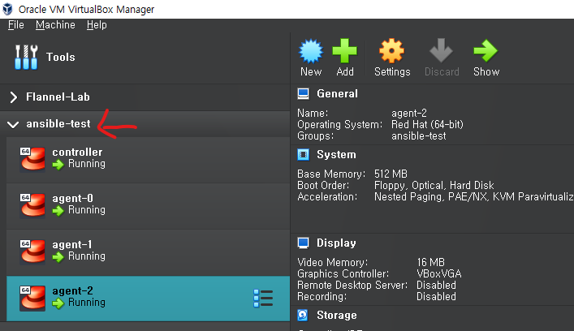

# 개요
ansible 연습

# 전제조건
* virtualbox 설치
* vagrant 설치
* 인터넷이 연결된 환경
* 최소사양:
  * cpu 4core 이상
  * memory 4GB 이상

# 실행방법
```shell
vagrant up
```

# 실행결과
* virtualbox에서 ansible-test group이 생성
* ansible-test group에는 총 4개 VM이 존재



# VM IP목록
* server: 172.16.0.10
* agent 3대: 172.16.0.12, 172.16.0.13, 172.16.0.14

# 원격접속
```shell
vagrant ssh controller
```

# 삭제방법
```shell
vagrant destroy --force
```
